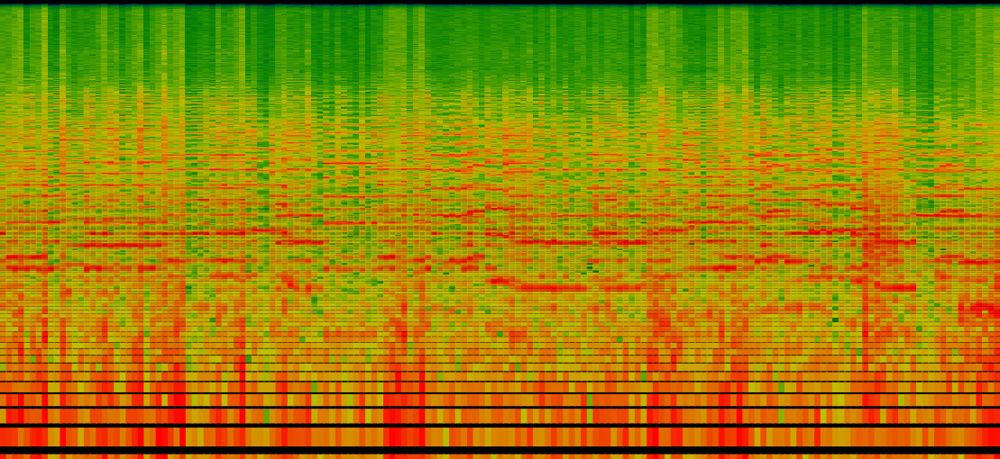

# Real-time Audio Spectrogram

A real-time audio spectrogram visualization tool built with Python (FastAPI) and JavaScript. This application captures audio input and displays a live frequency spectrum analysis with an interactive interface.



## Technology Stack


## Features

- Real-time audio capture and processing
- Interactive spectrogram visualization
- Frequency range: 20Hz - 20kHz
- Logarithmic frequency scale
- Dynamic dB scale (-120dB to 0dB)
- Interactive tooltips with detailed frequency information
- Export capabilities for captured spectrograms
- Responsive design

## Prerequisites

- Python 3.7+
- UV package manager
- Node.js 14+ (optional, for development)

## Required Python Packages

```bash
fastapi
uvicorn
pyaudio
numpy
scipy
```

## Installation

1. Clone the repository
```bash
git clone https://github.com/yourusername/realtime-spectrogram.git
cd realtime-spectrogram
```

2. Install UV (if not already installed)
```bash
curl -LsSf https://astral.sh/uv/install.sh | sh
```

3. Create and activate a virtual environment with UV
```bash
uv venv
source .venv/bin/activate  # On Windows use: .venv\Scripts\activate
```

4. Install dependencies using UV
```bash
uv pip install -r requirements.txt
```

Note: UV is a fast, reliable Python package installer and resolver. It's significantly faster than pip and provides better dependency resolution.

## Usage

1. Start the backend server:
```bash
python backend.py
```
This will start the FastAPI server at `http://localhost:8000`

2. Open `frontend.html` in your web browser

3. Click the "Start Recording" button to begin audio capture and visualization

## Application Structure

```
realtime-spectrogram/
├── backend.py          # FastAPI server and audio processing
├── frontend.html       # Web interface and visualization
├── requirements.txt    # Python dependencies
└── README.md          # This file
```

## How It Works

### Backend
- Uses PyAudio for real-time audio capture
- Processes audio data using NumPy and SciPy
- Performs Fast Fourier Transform (FFT) for frequency analysis
- Streams processed data via WebSocket

### Frontend
- Receives real-time data through WebSocket connection
- Renders spectrogram using HTML5 Canvas
- Provides interactive controls and visualization
- Supports data export and history management

## Controls

- **Start Recording**: Begins audio capture and visualization
- **Stop Recording**: Stops the audio capture
- **Clear History**: Clears the spectrogram history
- **Export Image**: Saves the current spectrogram as a PNG file

## Interactive Features

- Hover over the spectrogram to see detailed frequency and amplitude information
- Logarithmic frequency scale for better visibility across the spectrum
- Color-coded amplitude visualization
- Real-time updates at approximately 30 FPS

## Development

The application consists of two main components:

1. **Backend (Python)**
   - Audio capture and processing
   - FFT computation
   - WebSocket server
   - Data streaming

2. **Frontend (JavaScript)**
   - Real-time data visualization
   - User interface
   - Interactive features
   - Data export

## Troubleshooting

### Common Issues

1. **UV Installation Issues**
   - If UV installation fails, ensure you have curl installed
   - Try installing UV through your system's package manager
   - Verify your system meets UV's requirements
   - For Windows users, you might need to run PowerShell as administrator

2. **No audio input detected**
   - Check if your microphone is properly connected
   - Verify microphone permissions in your operating system
   - Ensure no other application is using the microphone

2. **WebSocket connection failed**
   - Verify the backend server is running
   - Check if the port 8000 is available
   - Ensure no firewall is blocking the connection

3. **Performance issues**
   - Try reducing the window size if CPU usage is high
   - Close other resource-intensive applications
   - Check system audio settings

## Contributing

1. Fork the repository
2. Create your feature branch (`git checkout -b feature/AmazingFeature`)
3. Commit your changes (`git commit -m 'Add some AmazingFeature'`)
4. Push to the branch (`git push origin feature/AmazingFeature`)
5. Open a Pull Request

## License

This project is licensed under the MIT License - see the [LICENSE](LICENSE) file for details.

## Acknowledgments

- FFT implementation using SciPy
- Audio processing with PyAudio
- Real-time web communication with FastAPI
- Frontend visualization using HTML5 Canvas

## Contact

Your Name - [@yourusername](https://twitter.com/yourusername)

Project Link: [https://github.com/yourusername/realtime-spectrogram](https://github.com/yourusername/realtime-spectrogram)